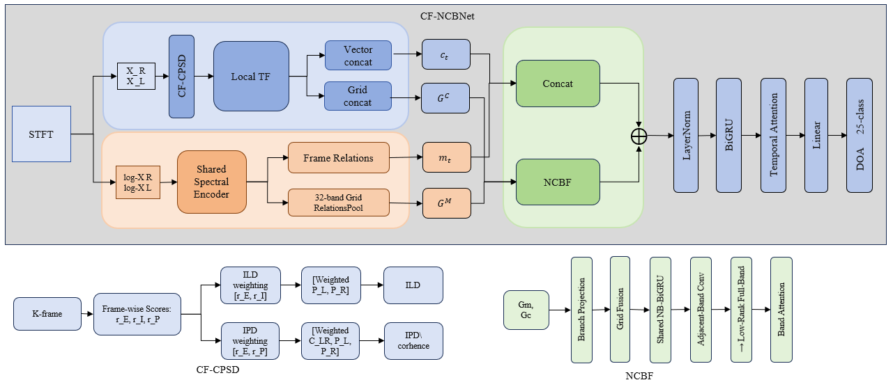

# CF-NCBNet：复杂干扰下的双耳目标语音定位

本项目研究静态双耳目标语音到达方向（DOA）估计。输入是一段含混响目标语音、1--3 个定向非语音干扰和可选扩散背景的双通道音频，输出为目标语音在正面水平面的离散方位。当前冻结主线为 **CF-NCBNet**（Cue-Factorized Narrow-/Cross-Band Network），包含 212,103 个可训练参数。

## 1. 背景与任务

双耳定位通常依赖耳间电平差（ILD）和耳间相位差（IPD）。在多个定向干扰与扩散噪声并存时，不同声源会在时频平面产生相互竞争的双耳线索：逐帧线索方差较大，而过早汇聚频率又会丢失同频长期轨迹及跨频一致性。

对耳道 $e\in\{L,R\}$，观测信号写为

```math
x_e[n]=h_{s,e}*s[n]+\sum_{i=1}^{N}h_{i,e}*v_i[n]+d_e[n],
```

其中 $s$ 是唯一目标语音，$v_i$ 是第 $i$ 个定向非语音干扰，$d_e$ 是可选扩散背景。模型不估计干扰方位，也不使用目标说话人的注册语音或身份嵌入。

目标方位从 25 个非均匀 CIPIC 水平角中选择：

```math
\Theta=\{-80^\circ,-65^\circ,-55^\circ,-45^\circ,-40^\circ,
\ldots,40^\circ,45^\circ,55^\circ,65^\circ,80^\circ\}.
```

网络输出 $\mathbf p\in\mathbb R^{25}$，最终预测为

```math
\hat\theta=\Theta_{\arg\max_j p_j}.
```

## 2. 方法重点

CF-NCBNet 围绕三个问题组织：

1. **线索专属短时统计**：ILD 由左右耳自功率比定义，IPD 由复互功率谱相位定义。CF-CPSD为二者学习不同的局部聚合权重。
2. **频率保持的长期建模**：在频率汇聚前，NCBF 依次处理同一频带的完整时间轨迹、相邻频带关系和低秩全带关系。
3. **稳定基线上的有界细化**：局部空间向量与双耳频谱向量构成逐帧基线；长期频带表示以零初始化的有界残差修正该融合表示。

需要准确理解当前结构：

- 双耳频谱支路含 mean / difference / absolute difference，差分项仍携带方向信息，因此它不是纯语义“内容支路”。
- NCBF 残差修正完整的 104 维融合表示，而不是只修正 24 维空间线索。
- $K=5$ 是固定经验窗口，不是自适应窗口或普遍最优解。

## 3. 模型结构



两个分支同时输出向量和频带网格，但并非重复编码。向量提供稳定的逐帧基线；网格保留频率顺序，供 NCBF 在频率汇聚前建模长期窄带和跨频关系。

### 3.1 复数 STFT

左右耳波形首先变换为

```math
X_e(t,f)=\operatorname{STFT}(x_e),\qquad e\in\{L,R\}.
```

当前配置使用 16 kHz 采样率、512 点 DFT、400 点 Hann 窗和 160 点帧移，保留 $F=257$ 个非负频点。10 ms 帧移下，五个连续帧的中心跨度约为 40 ms。

### 3.2 Cue-Factorized CPSD

对于中心时频点 $(t,f)$，取 $K=5$ 个连续帧。局部自功率和互功率定义为

```math
P_L^k=|X_L^k|^2,\qquad
P_R^k=|X_R^k|^2,\qquad
C^k=X_L^kX_R^{k*}.
```

均匀平均 $\bar P_L,\bar P_R,\bar C$ 只用作局部 pilot。每个候选帧构造相对能量、ILD 一致性和相位一致性：

```math
r_E^k=
\frac{\ell^k-\operatorname{mean}_j\ell^j}
{\max(\operatorname{std}_j\ell^j,0.1)},
\qquad
\ell^k=\log(P_L^k+P_R^k+\epsilon),
```

```math
r_I^k=-\frac14\min\left(|\rho^k-\bar\rho|,4\right),
\qquad
\rho^k=\log\frac{P_L^k+\epsilon}{P_R^k+\epsilon},
```

```math
r_P^k=\Re\left\{
\frac{C^k}{|C^k|+\epsilon}
\left(\frac{\bar C}{|\bar C|+\epsilon}\right)^*
\right\}.
```

ILD 与 IPD 使用两组独立可学习权重：

```math
w_I^k=\operatorname{softmax}_k
\left(a_E^I r_E^k+a_I r_I^k\right),
\qquad
w_P^k=\operatorname{softmax}_k
\left(a_E^P r_E^k+a_P r_P^k\right).
```

softmax 前的分数裁剪至 $[-6,6]$。四个系数从零初始化，因此训练起点满足 $w_I^k=w_P^k=1/K$，即严格退化为均匀 CPSD。

随后分别计算 ILD 所需自功率和 IPD 所需复互谱：

```math
\Phi_L^I=\sum_k w_I^kP_L^k,\qquad
\Phi_R^I=\sum_k w_I^kP_R^k,
```

```math
\Phi_{LR}^P=\sum_k w_P^kC^k,\qquad
\Phi_e^P=\sum_k w_P^kP_e^k.
```

最终显式线索为

```math
\mathrm{ILD}=10\log_{10}
\frac{\Phi_L^I+\epsilon}{\Phi_R^I+\epsilon},
```

```math
\mathbf u_{\mathrm{IPD}}=
\frac{\Phi_{LR}^P}{|\Phi_{LR}^P|+\epsilon}
=\cos(\mathrm{IPD})+j\sin(\mathrm{IPD}),
```

```math
\gamma=
\frac{|\Phi_{LR}^P|}
{\sqrt{\Phi_L^P\Phi_R^P+\epsilon}}.
```

网络使用 $[\sin(\mathrm{IPD}),\cos(\mathrm{IPD})]$，避免直接线性平均具有周期性的相位角。ILD 与 IPD 分开加权的目的，是保留二者不同的统计定义，而不是假设某一种线索始终更可靠。

### 3.3 局部空间表示

ILD 裁剪到 $[-40,40]$ dB 后除以 20。两个 LocalTF 分支的输入分别为

```math
[\widetilde{\mathrm{ILD}},\gamma],
\qquad
[\sin(\mathrm{IPD}),\cos(\mathrm{IPD}),\gamma].
```

每个分支依次使用标准 $3\times3$ 卷积、depthwise $3\times3$ 卷积和 pointwise $1\times1$ 卷积，再将频率轴汇聚为 32 个有序频带。中间网格为

```math
\mathbf G^I,\mathbf G^P\in\mathbb R^{T\times32\times8},
\qquad
\mathbf G^C=[\mathbf G^I;\mathbf G^P]
\in\mathbb R^{T\times32\times16}.
```

网格沿频带展平并经过轻量时间卷积，形成逐帧空间向量

```math
\mathbf c_t=[\mathbf c_t^I;\mathbf c_t^P]\in\mathbb R^{24},
\qquad
\mathbf c_t^I\in\mathbb R^8,\quad
\mathbf c_t^P\in\mathbb R^{16}.
```

### 3.4 双耳频谱上下文

左右耳对数幅度谱由同一个二维 CNN 编码。共享耳间参数使两耳特征位于同一表示空间。编码器保持时间分辨率，仅沿频率轴逐级下采样，得到

```math
\mathbf f_{L,t},\mathbf f_{R,t}\in\mathbb R^{96}.
```

逐帧双耳关系写为

```math
\mathbf f_{M,t}=\tfrac12(\mathbf f_{L,t}+\mathbf f_{R,t}),
\qquad
\mathbf f_{D,t}=\mathbf f_{L,t}-\mathbf f_{R,t},
```

```math
\mathbf m_t=\operatorname{MLP}
([\mathbf f_{M,t};\mathbf f_{D,t};|\mathbf f_{D,t}|])
\in\mathbb R^{80}.
```

编码器末端左右耳特征图同时汇聚为 32 带，并以相同关系构造

```math
\mathbf G^M\in\mathbb R^{T\times32\times192}.
```

该支路为定位提供声学活动和双耳频谱上下文，但 difference 与 absolute difference 和显式 ILD 存在信息重叠。因此，当前方法不把这组三项关系单独作为核心创新。

### 3.5 长期窄带与跨频建模

频谱网格 $\mathbf G^M$ 与空间网格 $\mathbf G^C$ 先分别归一化并投影为 16 维，再拼接映射为

```math
\mathbf H^0\in\mathbb R^{T\times32\times32}.
```

第一步在不混合频带的情况下处理每个频带的完整时间轨迹：

```math
\mathbf Z_{:,b}=\operatorname{BiGRU}_{\phi}
(\mathbf H^0_{:,b}),\qquad b=1,\ldots,32.
```

32 个频带共享参数 $\phi$。每个方向包含 16 个隐藏单元，输出投影回 32 维，并通过残差连接与 LayerNorm 得到 $\mathbf H^{\mathrm{NB}}$。参数共享表达的是“各频带采用相同的时间更新规则”，但各频带在进入该 GRU 前彼此独立。

第二步用 depthwise $1\times3$ 卷积和 pointwise $1\times1$ 卷积交换邻频信息：

```math
\mathbf H^{\mathrm{local}}=
\operatorname{LN}\left(
\mathbf H^{\mathrm{NB}}+
\mathcal C_{1\times3}(\mathbf H^{\mathrm{NB}})
\right).
```

第三步对每个时间--通道切片执行秩为 8 的全带映射：

```math
\mathbf H^{\mathrm{FB}}=
\operatorname{LN}\left(
\mathbf H^{\mathrm{local}}+
W_2\,\sigma(W_1\mathbf H^{\mathrm{local}})
\right),
```

其中 $W_1\in\mathbb R^{8\times32}$，$W_2\in\mathbb R^{32\times8}$。低秩结构降低了全带交互的参数量，但它只是一种结构约束，不保证自动学得物理一致的方向模式。

最后在频带轴执行注意力汇聚：

```math
\alpha_{t,b}=\operatorname{softmax}_b(a_{t,b}),
\qquad
\mathbf q_t=\sum_b\alpha_{t,b}\mathbf H^{\mathrm{FB}}_{t,b}
\in\mathbb R^{32}.
```

### 3.6 有界残差与片段级聚合

长期频带表示被投影为 104 维有界残差：

```math
\mathbf r_t=0.25\tanh(W_r\mathbf q_t+\mathbf b_r).
```

输出投影采用零初始化，训练开始时模型等价于不含该残差的融合基线。逐帧表示为

```math
\widetilde{\mathbf z}_t=
\operatorname{Dropout}\left[
\operatorname{LN}\left(
[\mathbf m_t;\mathbf c_t]+\mathbf r_t
\right)\right]
\in\mathbb R^{104}.
```

系数 0.25 只限制残差各坐标的绝对值，不保证它相对原特征始终很小，也不保证 80 维频谱部分和 24 维空间部分获得相同比例的修正。

$\widetilde{\mathbf z}_t$ 输入单层双向 GRU，每个方向隐藏维度为 80，得到 $\mathbf h_t\in\mathbb R^{160}$。时间注意力为

```math
\beta_t=\operatorname{softmax}_t\left(
\mathbf w_2^\top\tanh(W_1\mathbf h_t+\mathbf b_1)+b_2
\right),
```

```math
\mathbf h=\sum_t\beta_t\mathbf h_t,
\qquad
\mathbf p=\operatorname{softmax}(W_c\mathbf h+\mathbf b_c).
```

NCBF 中的 BiGRU 处理保留频带轴的逐带序列；末端 BiGRU 处理已经完成频带汇聚的 104 维逐帧序列。两者输入和职责不同，但都跨越完整时间轴，这是当前结构复杂度和潜在冗余的主要限制之一。

训练目标仅为标签平滑系数 $\eta=0.1$ 的 25 类交叉熵：

```math
\mathcal L=-\sum_{j=1}^{25}\widetilde y_j\log p_j,
\qquad
\widetilde y_j=(1-\eta)y_j+\frac{\eta}{25}.
```

当前主配置不使用角度回归、前后向辅助损失、目标掩码监督或可靠性传播损失。

## 4. 实验设置

### 4.1 数据与声学场景

当前训练协议位于 <code>data/librispeech_cipic_roomsim25_multidir_diffuse_train_v1</code>。

| 项目 | 设置 |
|---|---|
| 音频 | 16 kHz、2 秒、双通道 PCM16 |
| 目标 | LibriSpeech 语音，经 Roomsim-CIPIC BRIR 渲染 |
| 定向干扰 | 1--3 个经过自动人声过滤的 DNS wideband 非语音事件 |
| 扩散背景 | DNS 非语音频谱纹理 + 24 个 HRTF 方向定义的双耳相干约束 |
| 输出 | 25 类正面水平目标方位；正方位位于听者右侧 |
| 训练集 | 90,000 条，每个目标角 3,600 条 |
| val_core | 5,400 条，用于 checkpoint 选择和早停 |

定向干扰数量分布为

| $N$ | 1 | 2 | 3 |
|---:|---:|---:|---:|
| 数量 | 36,000 | 36,000 | 18,000 |
| 比例 | 40% | 40% | 20% |

目标与任一干扰、任意两个干扰之间的最小角距均为 $20^\circ$。训练中的聚合总 SIR 覆盖 $[-10,15]$ dB；另有 5,400 条 $N=2/3$ 样本采用逐源强干扰协议，每个干扰相对目标的 SIR 独立采样于 $[-5,0]$ dB。这两种 SIR 定义不能合并解释。

扩散背景在 65% 的训练样本中存在：

| 扩散条件 | 无扩散 | 5--10 dB | 0--5 dB | -5--0 dB |
|---|---:|---:|---:|---:|
| 比例 | 35% | 25% | 30% | 10% |

所有功率均在空间渲染后、目标活动采样点上按双耳联合功率计算。混合后左右耳使用同一个峰值安全缩放系数，避免耳间独立归一化破坏 ILD。

### 4.2 数据隔离与证据边界

训练和验证划分在 LibriSpeech 说话人、DNS source ID、CIPIC subject 和模拟房间层面均不重叠。这些划分用于检查合成域内对未见说话人、事件、人头和房间的联合泛化。


### 4.3 训练协议

| 项目 | 设置 |
|---|---|
| 优化器 | AdamW |
| 初始学习率 | $5\times10^{-4}$ |
| 权重衰减 | $10^{-4}$ |
| 调度器 | Cosine，最低学习率 $10^{-5}$ |
| Batch size | 64 |
| 最大 epoch | 100 |
| Dropout | 0.2 |
| 梯度裁剪 | 1.0 |
| Checkpoint 指标 | val_core MAE |
| 早停 | patience 15，最小改进 $0.01^\circ$ |
| 混合精度 | 关闭 |

主配置文件：

~~~text
configs/train_cipic_multidir_diffuse_train_v1_longterm_seed42.yaml
~~~

## 5. 运行方式

安装依赖：

~~~bash
pip install -r requirements.txt
~~~

训练当前主线：

~~~bash
python train.py \
  --config configs/train_cipic_multidir_diffuse_train_v1_longterm_seed42.yaml
~~~

在配置中的测试划分上评测：

~~~bash
python evaluate.py \
  --config configs/train_cipic_multidir_diffuse_train_v1_longterm_seed42.yaml \
  --checkpoint outputs/checkpoints_cipic_multidir_diffuse_train_v1_longterm_seed42/best_mae.pth
~~~

按干扰数量、SIR、扩散条件、subject 和房间分组评测：

~~~bash
python tools/evaluate_cipic_multidir_diffuse_train_v1_grouped.py \
  --config configs/train_cipic_multidir_diffuse_train_v1_longterm_seed42.yaml \
  --checkpoint outputs/checkpoints_cipic_multidir_diffuse_train_v1_longterm_seed42/best_mae.pth \
  --test_root data/librispeech_cipic_roomsim25_multidir_diffuse_train_v1/val_stress \
  --output_dir outputs/eval_multidir_diffuse_longterm_val_stress \
  --device cuda:0
~~~

## 6. 代码与文档

~~~text
configs/                         训练与评测配置
dataset/                         静态数据加载和特征准备
models/native_lite_v7.py         CF-CPSD、LocalTF、NCBF 与主模型
models/temporal_head.py          片段级时序聚合与分类头
engine/                          训练和评测循环
tools/                           数据生成、审计和分组评测脚本
docs/                            方法、实验协议和项目收束文档
~~~

- [当前 Method 草稿](docs/icassp_methods_bilingual_v1.md)
- [实验协议](docs/icassp_experimental_setup_bilingual_v1.md)
- [数据生成与审计报告](docs/cipic_multidir_diffuse_train_v1_generation_report_zh.md)
- [项目收束报告](docs/project_report_multidir_diffuse_train_v1_zh.md)
